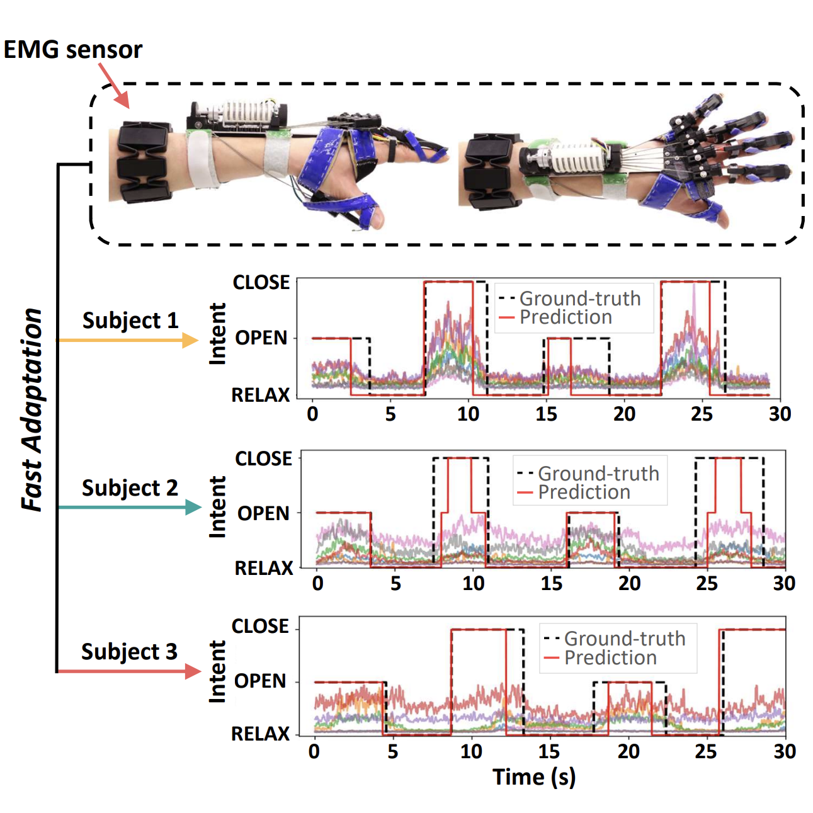

<h1> Meta-Learning for Fast Adaptation in Intent Inferral on a Robotic Hand Orthosis for Stroke</h1>
<div style="text-align: center;">

[Pedro Leandro La Rotta](#)$^{* , 1}$, [Jingxi Xu](https://jxu.ai/)$^{* , 1}$, [Ava Chen](https://avachen.net/)$^1$, [Lauren Winterbottom](#)$^2$, [Wenxi Chen](#)$^1$, [Dawn M. Nilsen](#)$^2$, [Joel Stein](#)$^2$, [Matei Ciocarlie](https://roam.me.columbia.edu/people/matei-ciocarlie)
$^1$

$^*$ Equal contribution, $^1$ Columbia University, $^2$ Columbia University Irving Medical Center

[Arxiv](https://arxiv.org/abs/2403.13147)

<div style="margin:50px; text-align: justify;">
   

This repo captures the models, data processing, and training scripts used in our work
applying meta learning to control a robotic hand orthosis using EMG signals. In this project
we use build a framework using Model-Agnostic Meta Learning (MAML) to train intent classifiers
for fast adaptation for use in a real robot. 

</div>
</div>

## Meta learning

Meta-learning, or learning to learn, is a machine learning approach where models are trained to quickly adapt to new tasks with minimal data. It focuses on generalization across tasks by teaching models high-level skills or representations, enabling rapid learning and adaptation to new, unseen challenges. 

Model-agnostic meta learning (MAML) is an algorithm developed in [Finn et al.](https://arxiv.org/pdf/1703.03400.pdf) where a model is fine-tuned to individual tasks, and the aggregate loss of the fine-tuned models with respect to the initial model's parameters is what's used for the gradient step of the initial model. This initial model is the meta model. 


In principle, this training paradigm should result in a model that primarily learns task-agnostic features allowing it to fine-tune to a new task more easily (assuming the new task is similar enough to the training tasks). In our context, this means a training paradigm that can more quickly learn the user's EMG-intent mapping and is also somewhat robust to concept drift.

Furthermore, we define a task as a single patient-condition instance represented by an 8-channel EMG recording, where condition is the 3-digit (111,112,131,etc) description of the procedure used to gather EMG data from them, and we define a task collection as a sampling of several tasks.

This repo contributes the following:

- A Python GUI for generating a task collection. Currently the GUI is pointed at the collected_data ROAM Lab repo, and it walks through all of the recordings in each session displaying the raw EMG signals as well as their corresponding ground-truth intent label. The GUI requests a save location at the end, but it is recommended to have it save to data/task_collections
- Dataset, task, and task collection data structures for convenient integration into meta learning frameworks
- A full MAML implementation based on the original TF implementation (https://github.com/cbfinn/maml) and the Higher module for higher-order gradients (https://github.com/facebookresearch/higher)
- Hydra integration so that experiments can be setup via YAML files and tracked easily

To run the GUI to generate a new task collection,

```python source/task_space_generator.py```

## Running...

To run, create a conda (or mamba) environment with numpy, tqdm, wandb, hydra-core, and higher install and run the following from the root of this repo:

```python train.py```

